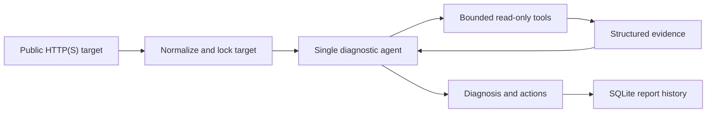

# ServicePath

**Agent-guided website diagnostics that explain where the collected evidence
suggests a request failed, instead of stopping at “the request timed out.”**

ServicePath accepts a public HTTP(S) URL and investigates it from the machine
where ServicePath is running. A single bounded diagnostic agent chooses useful
network checks, evaluates the returned evidence, and produces a report that the
browser workflow saves with:

- a reachable, degraded, unreachable, or inconclusive verdict;
- the Agent's assessment of the earliest observed failure stage;
- confidence and the evidence used for the conclusion;
- likely causes and practical next actions;
- selected-tool logs, check timings, and model usage.

The browser is the interface. Raw DNS, route, TCP, and TLS checks run in the
Flask process, not inside the browser sandbox.

## What ServicePath can tell you

| Stage | Evidence ServicePath can collect |
| --- | --- |
| Client | Available IPv4/IPv6 routes and configured system proxies |
| DNS | A/AAAA records, resolution errors, and public-address validation |
| Route | A short traceroute as supporting path evidence |
| TCP | Connection results and timing for the target port, or ports 80 and 443 |
| TLS | Handshake, trust, hostname match, protocol, cipher, and certificate expiry |
| HTTP | Redirects, response status, total HTTP-check duration, title, server header, and basic CDN/WAF signals |
| Application | A stage the Agent may infer when an HTTP response reached the site but still indicates an application problem |

For example, if DNS resolves successfully but every connection to port 443
times out, the collected evidence supports TCP as the failure boundary. TLS did
not fail—it could not start because TCP connectivity was never established.

## Quick start

Requirements:

- Python 3.10 or newer
- An API key for a model that supports tool calls and JSON output
- `traceroute` on macOS/Linux or `tracert` on Windows for optional route evidence
- Node.js only when changing the frontend

Clone and install on macOS or Linux:

```bash
git clone https://github.com/wljf817/ServicePath.git
cd ServicePath
python3 -m venv .venv
source .venv/bin/activate
python -m pip install -r requirements.txt
cp .env.example .env
chmod 600 .env
```

On Windows PowerShell, create the environment with `py -3.10 -m venv .venv`,
activate it with `.venv\Scripts\Activate.ps1`, install the same requirements,
and copy `.env.example` to `.env`.

Add the minimum Agent configuration to `.env`:

```text
OPENAI_API_KEY=your_key_here
OPENAI_MODEL=gpt-5.6
```

Start the local development server:

```bash
python app.py
```

Open `http://127.0.0.1:5050`, enter a public website or domain, and start an
investigation. Reports are stored in `instance/servicepath.db` and remain
available from History.

`python app.py` starts Flask with debug mode enabled. It is intended for local
development only, not public production deployment.

## How it works



ServicePath uses the
[OpenAI Agents SDK](https://developers.openai.com/api/docs/guides/agents) for
the model/tool loop. There is one Agent per execution location and no handoff
to specialist agents.

The Agent can select six server-owned tools:

1. Client network
2. DNS
3. Traceroute
4. TCP
5. TLS
6. HTTP

Tool dependencies are resolved automatically and cached. If the Agent asks for
TLS, for example, ServicePath first collects the required DNS and TCP evidence.
Each underlying check runs at most once, even if the Agent selects it again.

A normal run is limited to six unique checks and eight Agent turns. If a
supported SDK, provider, or output-parsing error occurs after evidence has been
collected, ServicePath preserves that evidence in an explicit low-confidence,
inconclusive report.

The output schema validates the conclusion's shape and allowed stage names. It
does not independently prove that the model's selected failure stage is
consistent with every collected result; the conclusion should always be read
alongside the evidence shown in the report.

## Execution modes

The current instance role is configured in Settings. The default role is
**Deployed Remote Server**.

| Mode | Where checks run | Availability |
| --- | --- | --- |
| Remote Test | On the current process when its role is `remote_server`; otherwise on the configured remote ServicePath instance | Both roles; `local_device` requires a remote URL |
| Local Test | On the current local ServicePath process | `local_device` only |
| Compare Both | Remote investigation first, then local investigation; the two reports are compared deterministically | `local_device` only |

A `remote_server` instance rejects Local Test and Compare Both because a hosted
webpage cannot execute raw network checks from a visitor's device. To observe a
user's network, run ServicePath on that device and select the `local_device`
role.

For a `local_device`, the remote URL saved through Settings takes precedence.
If it is blank, ServicePath falls back to `REMOTE_SERVICE_URL` from the
environment.

## Configuration

Provider credentials, tokens, the instance role, and the remote URL can be
configured in Settings. Existing secret values are never returned to the
browser. Secrets updated there are written to `.env` with owner-only permissions
and are not stored in SQLite. The API base URL is not treated as a secret and
remains visible so it can be edited or cleared.

| Variable | Default | Purpose |
| --- | --- | --- |
| `OPENAI_API_KEY` | Empty | Provider credential. Required on every instance that executes an Agent. |
| `OPENAI_MODEL` | `gpt-5.6` | Model identifier sent to the configured provider. |
| `OPENAI_BASE_URL` | OpenAI default | Optional OpenAI-compatible API base URL. |
| `OPENAI_API_MODE` | `auto` | `auto`, `responses`, or `chat_completions`. |
| `REMOTE_SERVICE_URL` | Empty | Environment fallback for the deployed ServicePath base URL used by a local instance. |
| `SERVICEPATH_API_TOKEN` | Empty | Shared bearer token for calls from a local instance to a remote `/api/diagnose`. |
| `SETTINGS_PASSWORD` | Empty | Protects settings changes. Without it, only loopback requests using a local host name may change settings. |

With no custom base URL, `auto` uses the OpenAI Responses API and typed Agent
output. The minimum OpenAI configuration is shown in Quick start.

### DeepSeek

DeepSeek uses the same `OPENAI_API_KEY` variable because ServicePath connects
through an OpenAI-compatible provider interface:

```text
OPENAI_API_KEY=your_deepseek_key
OPENAI_BASE_URL=https://api.deepseek.com
OPENAI_API_MODE=auto
OPENAI_MODEL=deepseek-v4-flash
```

With a custom base URL, `auto` selects Chat Completions. This ServicePath
version rejects the retired `deepseek-chat` and `deepseek-reasoner` identifiers;
use `deepseek-v4-flash` or `deepseek-v4-pro`. See DeepSeek's
[current model list](https://api-docs.deepseek.com/quick_start/pricing).

### Other compatible providers

Custom providers using Chat Completions must support function tools and JSON
object output. A custom provider that supports the Responses API can be selected
explicitly:

```text
OPENAI_BASE_URL=https://models.example/v1
OPENAI_API_MODE=responses
OPENAI_MODEL=provider-model-name
```

Agents SDK tracing is disabled whenever a custom API base URL is configured.
For the default OpenAI path, sensitive prompt and tool-return content is excluded
from trace spans by the application configuration.

## Connect a local and remote instance

On the deployed instance:

1. Keep the role set to **Deployed Remote Server**.
2. Configure its model provider key and model.
3. Set a strong `SERVICEPATH_API_TOKEN`.
4. Set `SETTINGS_PASSWORD` to protect settings writes.

On the local instance:

1. Select **Local Device** in Settings.
2. Enter the deployed ServicePath URL.
3. Configure its own model provider key and model when using Local Test or
   Compare Both.
4. Set the same `SERVICEPATH_API_TOKEN` used by the remote instance.

Every location that executes diagnostics needs its own model configuration. The
remote instance always needs one; the local instance needs one only for Local
Test and Compare Both. Compare Both runs Remote Test first and stops if that call
fails; otherwise it runs Local Test and saves the combined report locally.

## Remote API

`POST /api/diagnose` accepts a public target, normalizes it on the server, and
returns a complete remote report as JSON. Export the shared token in the current
shell before using the example; values in the project `.env` are not loaded into
your shell automatically.

```bash
export SERVICEPATH_API_TOKEN='replace-with-shared-token'
curl -X POST https://servicepath.example/api/diagnose \
  -H "Authorization: Bearer $SERVICEPATH_API_TOKEN" \
  -H "Content-Type: application/json" \
  -d '{"target":"https://example.com"}'
```

The bearer token is required only when `SERVICEPATH_API_TOKEN` is configured on
the remote instance. A direct `/api/diagnose` call does not save the report in
the remote instance's history.

| Route | Purpose |
| --- | --- |
| `GET /`, `/history`, `/settings`, `/reports/<id>` | React application pages |
| `POST /settings` | Legacy HTML form for updating only the instance role and remote URL |
| `POST /diagnose` | Run a selected mode and save the resulting report locally |
| `GET /api/history` | Return up to 50 recent report summaries |
| `GET /api/reports/<id>` | Return one saved report |
| `GET /api/app-settings` | Return non-secret application settings and configuration state |
| `POST /api/app-settings` | Validate and update application settings |
| `POST /api/diagnose` | Run a remote Agent without saving it on that remote instance |

## Security and privacy

ServicePath places application-level boundaries around the diagnostic Agent:

- The target is normalized and locked before the Agent starts.
- Tool schemas do not accept a hostname, URL, port, shell command, or arbitrary
  argument from the model.
- Literal private, loopback, link-local, and reserved targets are rejected.
- DNS results are checked before network operations, and every HTTP redirect is
  normalized and checked again.
- Connection attempts, redirects, response sampling, traceroute output, tool
  count, and Agent turns have explicit limits. Agent tool waits have SDK
  timeouts, and most underlying network operations set their own timeouts.
- Traceroute uses a fixed argument list and never invokes a command shell.

The target URL and selected diagnostic evidence are sent to the configured model
provider because the Agent needs them to reason about the investigation.

> [!WARNING]
> These controls are not an operating-system sandbox or a complete SSRF defense.
> The HTTP library resolves a checked hostname again when it connects, leaving a
> residual DNS-rebinding/time-of-check-to-time-of-use risk. A production deployment
> must enforce outbound firewall or container network policy independently.

> [!WARNING]
> This repository does not provide general user authentication or rate limiting.
> Only `/api/diagnose` has optional bearer-token protection. The browser diagnosis
> route and report/history read APIs can consume model quota or expose stored
> evidence when published directly. Put authentication, authorization, request
> limits, and TLS in front of any public deployment.

`SETTINGS_PASSWORD` protects settings writes only. It is not a login for the
Settings page: `GET /settings` and `GET /api/app-settings` remain readable and
the latter exposes non-secret configuration such as role, remote URL, model,
base URL, and configured/not-configured state.

For production, also use a production WSGI server and reverse proxy, persist the
`instance/` directory, protect `.env`, and monitor model and network usage. This
repository does not currently include a production server dependency, container
image, or turnkey deployment configuration.

## Development

```text
app.py                       Flask routes and JSON API
app_settings.py              Environment-setting validation
database.py                  SQLite reports and instance settings
diagnostics/agent.py         Single-Agent runtime and report assembly
diagnostics/agent_models.py  Typed Agent conclusion
diagnostics/agent_tools.py   Locked context, budgets, and Agent tools
diagnostics/                 Network checks and target validation
frontend/                    React 19 and HeroUI v3 source
static/frontend/             Production frontend served by Flask
templates/                   Non-JavaScript fallback and error pages
tests/                       Offline unittest suite
instance/servicepath.db      Local database created at runtime
```

The production frontend is committed in `static/frontend/`; Node.js is not
required to run ServicePath. Frontend development with Vite 8 requires Node.js
`^20.19.0` or `>=22.12.0`.

Install the locked frontend dependencies and start Vite from the repository
root:

```bash
npm ci
npm run dev
```

Keep Flask running on port 5050 and open `http://127.0.0.1:5173`. Vite proxies
API requests to Flask. Rebuild the committed production assets after frontend
changes:

```bash
npm run build
```

Run the offline unit tests after activating the Python environment:

```bash
python -m unittest discover -s tests
```

The tests mock model and public-network boundaries; they do not require an API
key or a particular external website.

## Known limitations

- Results are returned after the Agent finishes; tool events are not streamed to
  the browser yet.
- An SDK tool timeout stops the Agent from waiting, but it cannot terminate an
  already-running worker thread. System DNS resolution has no application-level
  deadline, and HTTP timeouts are connect/read-idle limits rather than a hard
  deadline for the entire request.
- ServicePath does not run a real browser engine or execute page JavaScript. It
  cannot reproduce browser-only failures involving CORS, CSP, cookies, browser
  extensions, cached state, or frontend runtime errors.
- A webpage cannot inspect a visitor's raw DNS, TCP, or TLS path. Local Test
  requires a ServicePath process running on the user's device.
- Traceroute is optional supporting evidence. Missing and unanswered hops are
  common and do not prove that normal traffic is blocked.
- DNS uses the operating system resolver; it does not compare public resolvers
  or query CNAME and WHOIS data.
- Client Network reports route availability and proxy presence, not public IP,
  ISP, ASN, or geolocation.
- Proxy-managed Fake-IP addresses in `198.18.0.0/15` are accepted as a special
  case. Raw TCP/TLS checks are skipped and HTTP uses the configured proxy.
- SQLite history requires persistent storage. A temporary or serverless
  filesystem loses saved reports.
